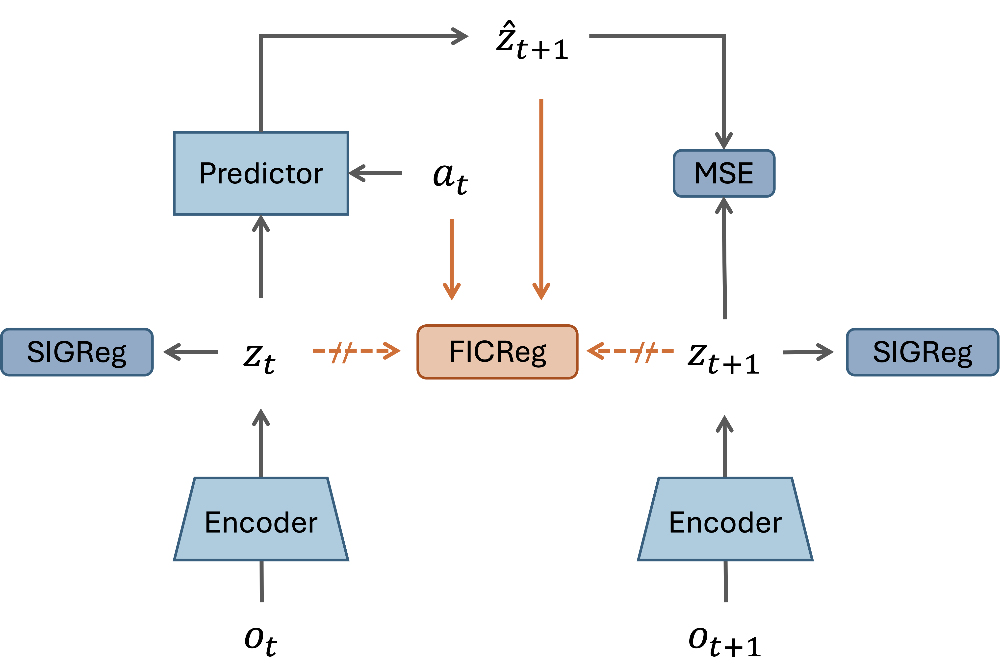
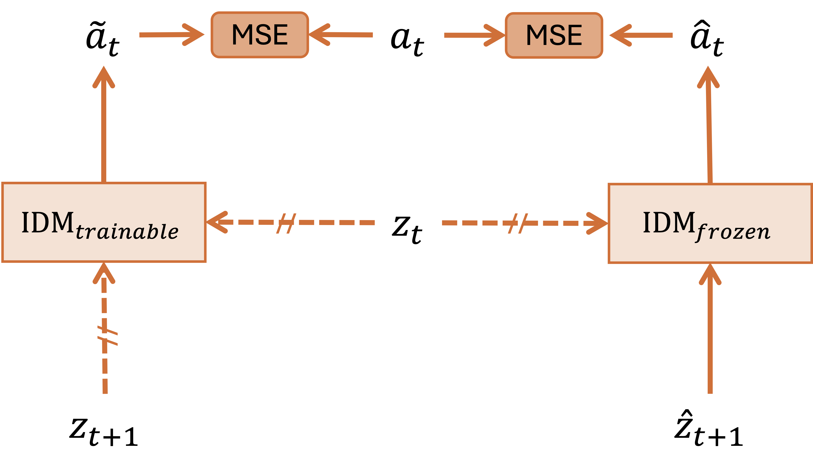

# FICReg: Forward-Inverse Consistency Regularization for Latent World Models

Official implementation of [FICReg](https://openreview.net/forum?id=uqlwZg5wCC) (ICML 2026 Workshop on DEMO).

## Overview

Forward predictors in JEPA-based world models can match target states without faithfully encoding the causal effect of actions. FICReg regularizes the predictor by training an IDM on ground-truth transitions, then freezing it and applying it to predicted transitions — gradients flow only into the predictor, leaving the encoder and IDM untouched.

## Method

FICReg adds two auxiliary losses on top of the baseline world model. The overall architecture is shown below — dashed arrows indicate detached (no-gradient) paths.

<p align="center">
  
</p>

Let $o_t$ denote the observation, $a_t$ the action, $z_t = f_\theta(o_t)$ the encoder output, and $\hat{z}\_{t+1} = g_\phi(z_{1:t}, a_t)$ the **predicted** next state from the forward predictor.

**Ground-Truth IDM Loss** — The IDM learns to recover actions from ground-truth transitions. Both encoder outputs are detached to prevent co-adaptation:

$$\mathcal{L}\_{\text{idm}} = \lVert \text{IDM}(\bar{z}\_t, \bar{z}\_{t+1}) - a_t \rVert^2$$

**Forward-via-IDM Consistency Loss** — The same IDM is frozen and applied to **predicted** transitions $\hat{z}\_{t+1}$. Gradients flow only into the predictor, pushing it to produce states from which the executed action is recoverable:

$$\mathcal{L}\_{\text{fwd}} = \lVert \text{IDM}\_{\text{frozen}}(\bar{z}\_t, \hat{z}\_{t+1}) - a_t \rVert^2$$

where $\bar{z}$ denotes a detached (stop-gradient) state.

<p align="center">
  
</p>

The full objective:

$$\mathcal{L} = \mathcal{L}\_{\text{pred}} + \lambda \mathcal{L}\_{\text{sigreg}} + \mu \mathcal{L}\_{\text{idm}} + \gamma \mathcal{L}\_{\text{fwd}}$$

## Results

Success rates across environments (epoch 10, mean ± std over 3 seeds):

|     Method      |   TwoRoom    |      PushT       |     Reacher      |   OGBench-Cube   |
| :-------------: | :----------: | :--------------: | :--------------: | :--------------: |
| LeWM (re-impl.) | 87.3 ± 1.9 |   88.7 ± 2.5   |   78.7 ± 3.4   | **75.3 ± 2.5** |
|     FICReg      | 87.3 ± 0.9 | **94.0 ± 3.3** | **81.3 ± 4.1** |   72.0 ± 1.6   |

## Installation

This codebase builds on [stable-worldmodel](https://github.com/galilai-group/stable-worldmodel) for environment management, planning, and evaluation, and [stable-pretraining](https://github.com/galilai-group/stable-pretraining) for training.

```bash
uv venv --python=3.10
source .venv/bin/activate
uv pip install stable-worldmodel[train,env]
```

## Data

Datasets use the HDF5 format. Download from the [LeWM Hugging Face collection](https://huggingface.co/collections/quentinll/lewm).

Place the extracted `.h5` files under `$STABLEWM_HOME` (defaults to `~/.stable-wm/`):
```bash
export STABLEWM_HOME=/path/to/your/storage
```

## Training

Training is configured via [Hydra](https://hydra.cc/) config files under `config/train/`.

Before training, set your WandB credentials in `config/train/lewm.yaml`:
```yaml
wandb:
  config:
    entity: your_entity
    project: your_project
```

To train FICReg on PushT:
```bash
python train.py data=pusht
```

The FICReg-specific loss weights are configured in `config/train/lewm.yaml`:
```yaml
loss:
  idm:
    weight: 0.1      # mu: ground-truth IDM loss weight
  fwd_via_idm:
    weight: 0.1      # gamma: forward-via-IDM consistency loss weight
```

To run training across multiple seeds:
```bash
bash run_train.sh python train.py data=pusht output_model_name=ficreg-SEEDNUM seed=SEEDNUM
```

Checkpoints are saved to `$STABLEWM_HOME` upon completion.

## Evaluation

Evaluation uses MPC planning with CEM. Set the `policy` field to the checkpoint path relative to `$STABLEWM_HOME`, without the `_object.ckpt` suffix:

```bash
python eval.py --config-name=pusht.yaml policy=pusht_ficreg/lewm
```

To evaluate all checkpoints across seeds:
```bash
bash run_eval.sh ficreg-SEEDNUM pusht.yaml pusht
```

Or run the full train-then-evaluate pipeline:
```bash
bash run_pipeline.sh pusht.yaml python train.py data=pusht output_model_name=ficreg-SEEDNUM seed=SEEDNUM
```

## Acknowledgements

This implementation builds on [LeWorldModel](https://github.com/lucas-maes/le-wm) by Maes et al. and the [stable-worldmodel](https://github.com/galilai-group/stable-worldmodel) framework. We thank the authors for making their code publicly available.

## Citation

```bibtex
@inproceedings{seo2026ficreg,
  title={FICReg: Forward-Inverse Consistency Regularization for Latent World Models},
  author={Seo, Sungwon and Choe, Jean Seong Bjorn and Kim, Jong-Kook},
  booktitle={ICML 2026 Workshop on Decision-Making from Offline Datasets to Online Adaptation},
  year={2026}
}
```
